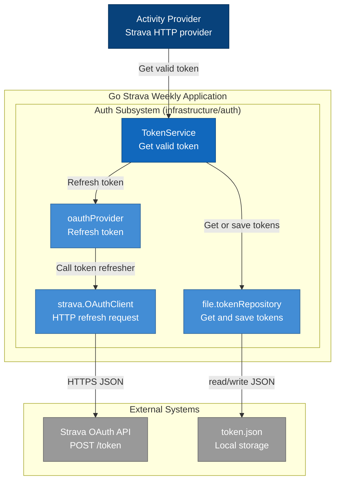

# C4 Component Diagram - Auth

This diagram shows the auth components inside the application and their relationships with external systems.

```mermaid
graph TB
    ActivityProvider["Activity Provider<br/>Strava HTTP provider"]

    subgraph External[External Systems]
        StravaOAuth["Strava OAuth API<br/>POST /token"]
        TokenFile["token.json<br/>Local storage"]
    end

    subgraph App["Go Strava Weekly Application"]
        subgraph Auth["Auth Subsystem (infrastructure/auth)"]
            TokenService["TokenService<br/>Get valid token"]
            OAuthProvider["oauthProvider<br/>Refresh token"]
            OAuthClient["strava.OAuthClient<br/>HTTP refresh request"]
            TokenRepository["file.tokenRepository<br/>Get and save tokens"]
        end
    end

    ActivityProvider -->|Get valid token| TokenService
    TokenService -->|Get or save tokens| TokenRepository
    TokenService -->|Refresh token| OAuthProvider
    OAuthProvider -->|Call token refresher| OAuthClient
    OAuthClient -->|HTTPS JSON| StravaOAuth
    TokenRepository -->|read/write JSON| TokenFile

    classDef consumerStyle fill:#08427b,stroke:#052e56,color:#fff
    classDef authStyle fill:#1168bd,stroke:#0b4884,color:#fff
    classDef componentStyle fill:#438dd5,stroke:#2e6295,color:#fff
    classDef externalStyle fill:#999,stroke:#666,color:#fff

    class ActivityProvider consumerStyle
    class TokenService authStyle
    class OAuthProvider,OAuthClient,TokenRepository componentStyle
    class StravaOAuth,TokenFile externalStyle
```
