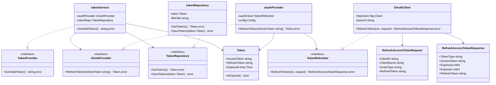

# Class Diagram - Auth

```mermaid
classDiagram
  class TokenProvider {
    <<interface>>
    +GetValidToken() string,error
  }

  class OAuthProvider {
    <<interface>>
    +RefreshToken(refreshToken string) Token,error
  }

  class TokenRepository {
    <<interface>>
    +GetTokens() Token,error
    +SaveTokens(token Token) error
  }

  class TokenRefresher {
    <<interface>>
    +RefreshToken(ctx, request) RefreshAccessTokenResponse,error
  }

  class tokenService {
    -oauthProvider OAuthProvider
    -tokenRepo TokenRepository
    +GetValidToken() string,error
  }

  class oauthProvider {
    -oauthClient TokenRefresher
    -config Config
    +RefreshToken(refreshToken string) Token,error
  }

  class OAuthClient {
    -httpClient http.Client
    -baseUrl string
    +RefreshToken(ctx, request) RefreshAccessTokenResponse,error
  }

  class tokenRepository {
    -token Token
    -filePath string
    +GetTokens() Token,error
    +SaveTokens(token Token) error
  }

  class Token {
    +AccessToken string
    +RefreshToken string
    +ExpiresAt time.Time
    +IsExpired() bool
  }

  class RefreshAccessTokenRequest {
    +ClientID string
    +ClientSecret string
    +GrantType string
    +RefreshToken string
  }

  class RefreshAccessTokenResponse {
    +TokenType string
    +AccessToken string
    +ExpiresAt int64
    +ExpiresIn int64
    +RefreshToken string
  }

  tokenService ..|> TokenProvider
  tokenService --> OAuthProvider
  tokenService --> TokenRepository
  oauthProvider ..|> OAuthProvider
  oauthProvider --> TokenRefresher
  OAuthClient ..|> TokenRefresher
  tokenRepository ..|> TokenRepository
  tokenService --> Token
  oauthProvider --> Token
  OAuthClient --> RefreshAccessTokenRequest
  OAuthClient --> RefreshAccessTokenResponse
```
