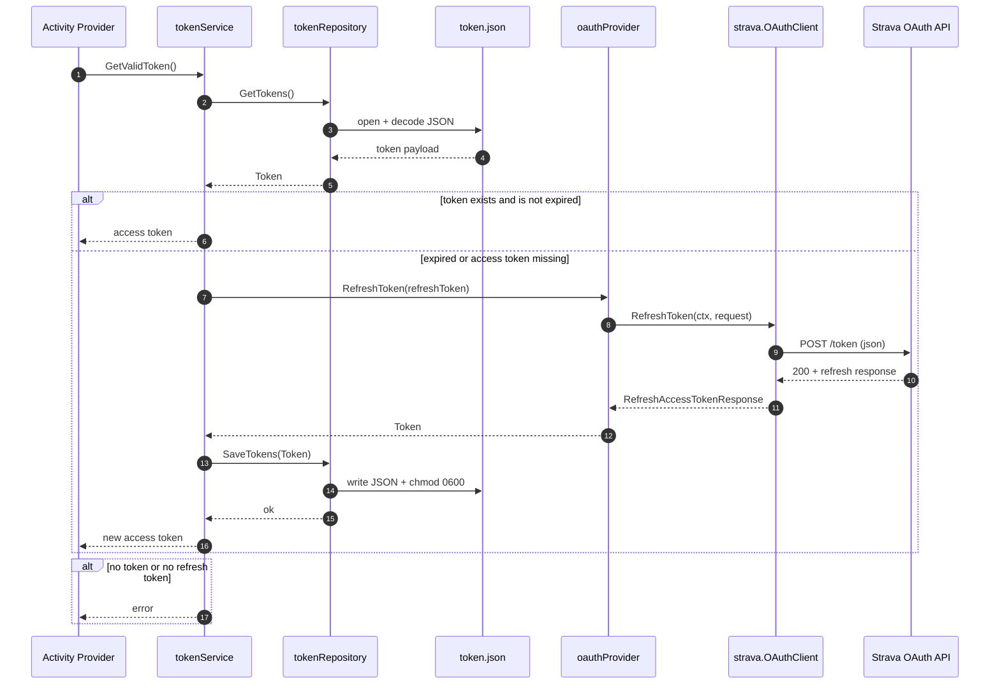

# Sequence Diagram - Auth Token Resolution

```mermaid
sequenceDiagram
  autonumber
  participant Consumer as Activity Provider
  participant TS as tokenService
  participant Repo as tokenRepository
  participant File as token.json
  participant OP as oauthProvider
  participant OC as strava.OAuthClient
  participant OAuth as Strava OAuth API

  Consumer->>TS: GetValidToken()
  TS->>Repo: GetTokens()
  Repo->>File: open + decode JSON
  File-->>Repo: token payload
  Repo-->>TS: Token

  alt token exists and is not expired
    TS-->>Consumer: access token
  else expired or access token missing
    TS->>OP: RefreshToken(refreshToken)
    OP->>OC: RefreshToken(ctx, request)
    OC->>OAuth: POST /token (json)
    OAuth-->>OC: 200 + refresh response
    OC-->>OP: RefreshAccessTokenResponse
    OP-->>TS: Token
    TS->>Repo: SaveTokens(Token)
    Repo->>File: write JSON + chmod 0600
    Repo-->>TS: ok
    TS-->>Consumer: new access token
  end

  alt no token or no refresh token
    TS-->>Consumer: error
  end
```
