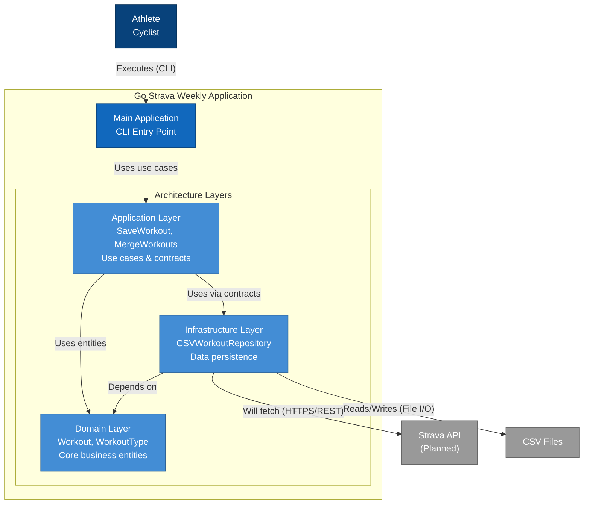

# C4 Container Diagram

This diagram shows the high-level technical architecture of the Go Strava Weekly application.

## Notes

- **Clean Architecture**: The application follows Clean Architecture principles with clear separation of concerns
- **Domain Layer**: Core business entities that are independent of external frameworks
- **Application Layer**: Use cases orchestrate the business logic
- **Infrastructure Layer**: Currently implements CSV-based storage; Strava API integration is planned
