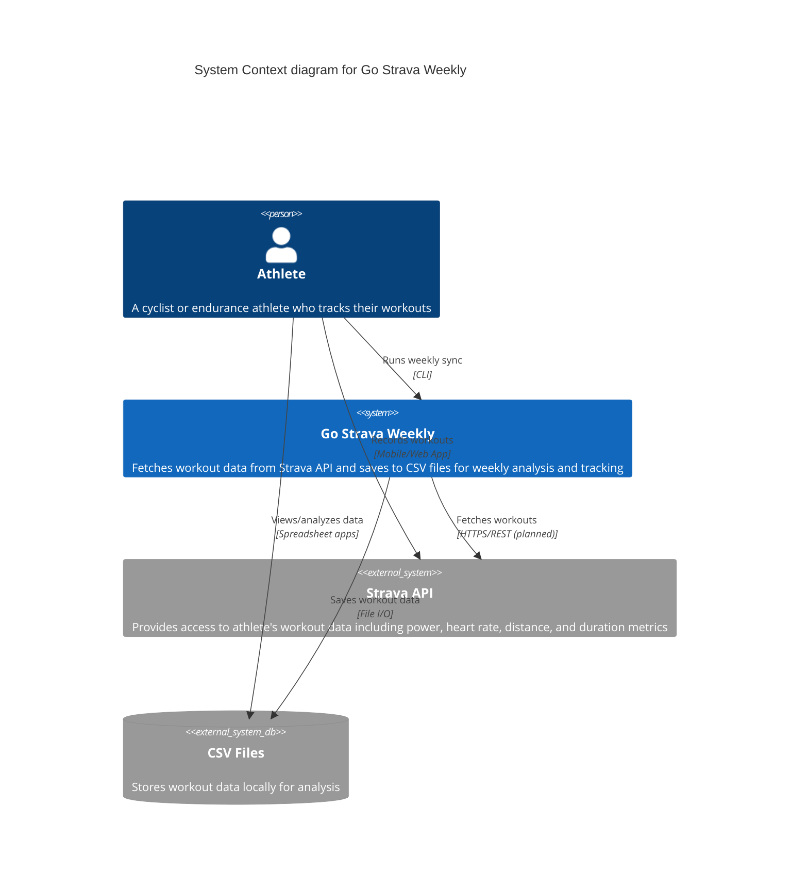

# C4 Context Diagram

This diagram shows the system context for the Go Strava Weekly application.

## Notes

- **Strava API integration** is currently planned but not yet implemented
- The application currently focuses on processing and storing workout data to CSV files
- CSV storage allows for easy analysis using spreadsheet applications
