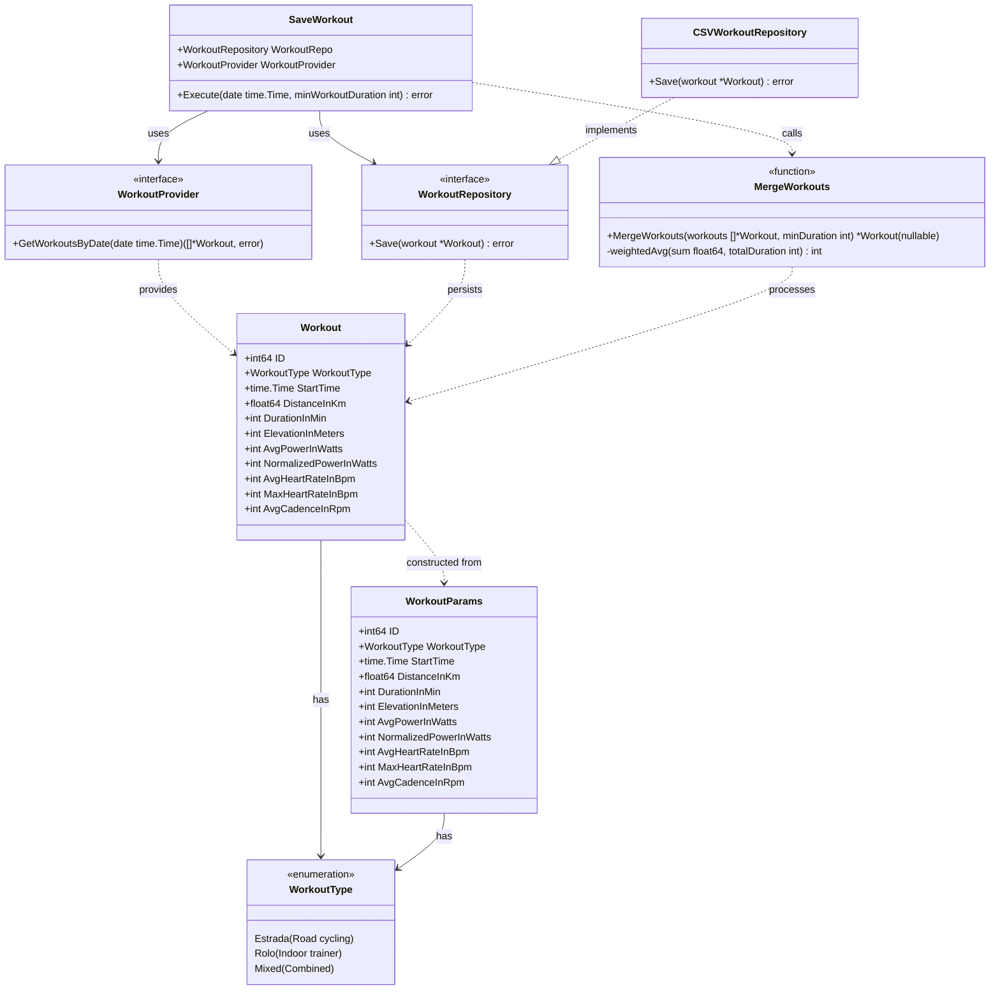

# Domain Model Diagram

This diagram shows the domain entities, use cases, and their relationships in the Go Strava Weekly application.

## Business Rules

### MergeWorkouts Function
The `MergeWorkouts` function implements the following business logic:
- **Filters** workouts by minimum duration threshold
- **Merges** multiple workouts from the same day into a single workout
- **Sums** the following metrics: distance, duration, elevation
- **Calculates weighted averages** for: power, heart rate, cadence, normalized power
- **Preserves** the maximum heart rate across all workouts

### SaveWorkout Use Case
The `SaveWorkout` struct orchestrates the workflow:
1. Fetches workouts for a given date using `WorkoutProvider`
2. Merges workouts using the `MergeWorkouts` function
3. Saves the merged workout using `WorkoutRepository`

### Key Metrics
Each workout tracks the following metrics:
- **Power metrics** for training analysis (average and normalized power)
- **Heart rate zones** tracking (average and maximum)
- **Distance and elevation** for route planning
- **Cadence** for pedaling efficiency

## Implementation Notes

- `MergeWorkouts` is implemented as a **standalone function**, not a class/struct
- `SaveWorkout` is a **struct** with dependencies injected (WorkoutRepo and WorkoutProvider)
- Currently, only **CSVWorkoutRepository** is implemented in the infrastructure layer
- **WorkoutProvider** interface is defined in contracts but no implementation exists yet (Strava integration planned)
